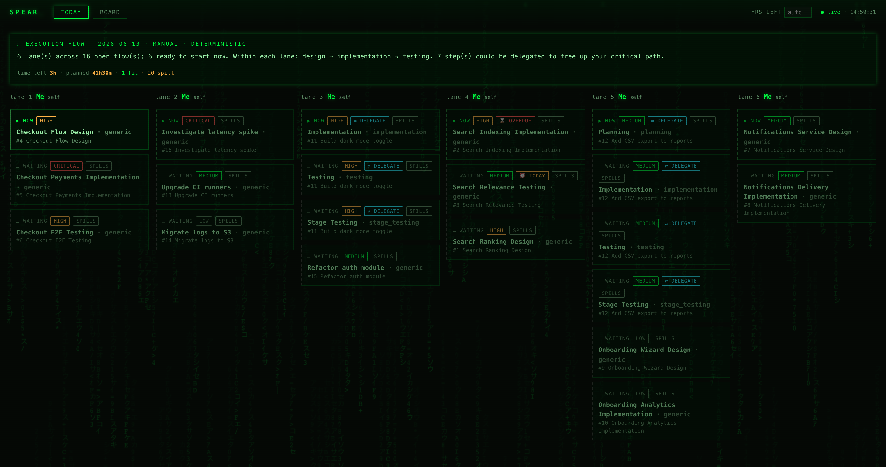
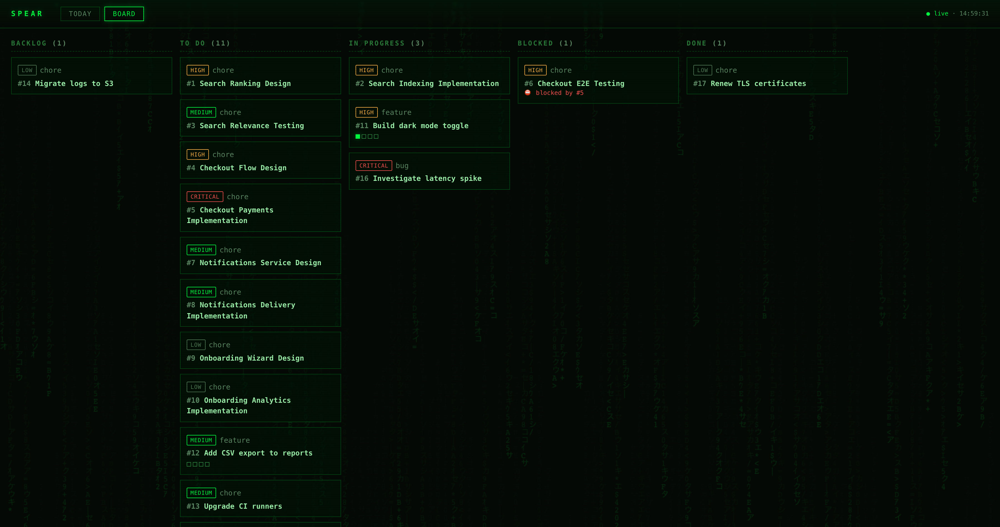

# spear

A fully-local, **Matrix-themed** personal project tracker with an LLM execution-flow planner.

You drive it from a terminal CLI, watch it in a localhost dashboard, and every morning an
LLM produces a parallelism-maximizing "execution flow" for the day — re-planning in real time
as ad-hoc tasks land. Everything lives on your machine: a SQLite file at `~/.spear/spear.db`.

```
describe a task ──▶ LLM breaks it down ──▶ set a priority ──▶ every morning (and on every
   (CLI)            (feature → Planning →     (critical/…/low)     ad-hoc add) an LLM lays out
                     Implementation →                              the day across parallel lanes,
                     Testing → Stage Testing;                      delegating what it can so your
                     else its own judgment)                        own critical path is shortest.
```

See [CHANGELOG.md](CHANGELOG.md) for release notes.

## Screenshots

**Today — the execution flow.** Open flows are grouped into lanes by theme (capped at 6), ordered
design → implementation → testing within each lane; only each lane's next step is "▶ now", and
delegatable steps are flagged:



**Board — tasks by status**, with stage progress, priorities, and blocked-by dependencies:



> The screenshots use throwaway demo data (`scripts/build-demo.sh`). Regenerate them with
> `npm run screenshots` (needs Google Chrome).

## Install

```bash
npm install
npm run build          # compiles the CLI/server (dist/) and the web app (dist/web/)
npm link               # optional: puts `spear` on your PATH (otherwise use `node dist/cli.js`)
spear init             # creates ~/.spear, seeds the "Me" executor, writes the 8am launchd job
```

> **No API key.** spear's LLM calls (breakdown, planning, due-date suggestions, duplicate
> detection) run through your local **Claude Code CLI** login — there is no `ANTHROPIC_API_KEY`
> and nothing is sent anywhere but Anthropic via that CLI. Your task data lives in `~/.spear/`.

### Try it with demo data

```bash
npm run screenshots    # builds a throwaway demo board in a temp dir and writes docs/screenshots/*
# …or drive it yourself:
SPEAR_HOME=/tmp/spear-demo node dist/cli.js init --no-launchd
SPEAR_HOME=/tmp/spear-demo SPEAR_CLI="node dist/cli.js" bash scripts/build-demo.sh
SPEAR_HOME=/tmp/spear-demo node dist/cli.js serve --port 4399 --open
```

## Everyday use

```bash
spear add "Fix prod outage in billing"                       # priority auto-inferred (→ critical)
spear add "Ship onboarding revamp" --due 2026-09-01          # due date feeds priority + ordering
spear add "Rename a config var" --task                       # force a lean, non-feature breakdown
spear add "Ship v2 billing" --feature --blocked-by 1         # full Planning→Impl→Testing flow; depends on #1
spear add "Renew SSL cert" --force                           # skip the duplicate-task check

spear list                       # open tasks + next stage + blockers
spear show 1                     # a task's stages, deps, delegation hints
spear done 1                     # advance the flow (complete the next stage)
spear done 1 --all               # complete the whole task
spear status 3 in_progress       # set status explicitly
spear block 4 --by 1             # add / remove a dependency
spear unblock 4 --by 1

spear goal add "Run 20km this week"   # weekly goals (also on the dashboard Goals tab)
spear goal list

spear plan                       # FULL re-cluster of today's lanes (LLM if available)
spear today                      # print the current execution flow
spear serve --open               # start the dashboard at http://127.0.0.1:4317
```

The CLI and dashboard stay in sync: any change pings a running `serve` so the browser updates
live over SSE; with no server running, the plan is refreshed inline so `today`/`serve` are current.

### A seamless day

- **Zero-decision capture.** `spear add "..."` auto-infers priority from urgency words, the due
  date, and whether it blocks others (the LLM refines it when keyed); `--priority` always wins.
- **Sticky lanes.** Lane membership persists, so adding a task mid-day **slots it into the right
  lane without reshuffling the rest of your day** — a lane only lightly re-balances when overloaded.
  The full (LLM) re-cluster happens at `spear plan` and the morning job.
- **Due-date aware.** Overdue / due-today tasks float to the top of their lane (⌛ / ⏰).

## Dashboard

`spear serve --open` opens a dark, Matrix-themed dashboard at http://127.0.0.1:4317 with four
tabs, all live over SSE:

- **Today** — the generated execution flow: parallel lanes (count configurable from the header),
  each lane's next step flagged ▶ now, delegatable steps marked, overdue / due-today badges. Each
  card is one **step** of a task; **▶ start / ✓ done act on that step alone**, so a multi-step
  task's stages advance independently (completing a step removes just that card). Each step also
  carries **its own date** (the task's overall date is its latest step). The
  **add bar** on top turns plain English — **or a pasted image** — into one or more tasks:
  - splits a multi-task capture (or a screenshot of a list) into separate flows;
  - an **auto / task / feature** toggle (feature → full Planning → Implementation → Testing);
  - **auto** or explicit priority;
  - warns if a task looks like a **duplicate** of an existing one, with **Add anyway**;
  - click **+ due** for a one-click suggested deadline (pre-computed from priority + your load).
  - **⟳ replan dates** re-decides every open task's completion date in one pass: all tasks are
    ordered globally by priority and scheduled by a configurable **tasks/day** capacity (header
    control; **auto** = the lane count), where a *large* task counts as two. Robust to lane
    reordering.
- **Board** — tasks by status (Backlog · To Do · In Progress · Blocked · Done) with stage
  progress and blockers, plus quick actions **▶ start** / **✓ done** / **✕** and click-to-edit
  priority.
- **Week** — a running Mon→Sun calendar with each **step** placed on its own day; drag a step onto
  a day to set its date, or onto Unscheduled to clear it.
- **Metrics** — tasks **completed** and **added** today and this week, plus a **weekly burndown**
  (open tasks remaining + cumulative completed).
- **Goals** — weekly goals in two sub-tabs:
  - **List** — a simple, free-form goal list (add / inline-edit / tick off / delete).
  - **Scorecard** — a weekly-focus card of weighted metrics
    (`Task · Progress · Goal · Score · Weight · % Completion`) with a live Total, plus
    **Bonus Tasks → Rewards**. Score = `weight × min(progress/goal, 1)`.

The header's **⤓ Desktop app** button installs spear as a native window (below).

## Desktop app (Electron)

spear can run as a native desktop window instead of a browser tab. The Electron shell
(`electron/main.cjs`) boots the same server in-process and shares your `~/.spear` data.

**Get it from the dashboard.** Open the dashboard in your browser and click **⤓ Desktop app**
in the header — it detects your OS (macOS / Windows) and downloads the matching installer from the
**latest GitHub Release** (falling back to a locally-built `release/` file if GitHub is unreachable).

**Build the installers** (writes to `release/`):

```bash
npm run dist:mac     # → release/spear-<ver>-<arch>.dmg   (build on macOS)
npm run dist:win     # → release/spear Setup <ver>.exe     (build on Windows, or via CI)
npm run electron:dev # run the desktop shell locally without packaging
```

> Native installers are platform-specific: build the `.dmg` on macOS and the `.exe` on
> Windows (or use CI — below). `better-sqlite3` is rebuilt for Electron's ABI during packaging
> (`npmRebuild`); the `dist:*` scripts then run `npm rebuild better-sqlite3` (a `postdist` hook)
> to restore the plain-Node ABI so the `spear` CLI keeps working. The mac build is unsigned
> (`identity: null`); right-click → Open the first time.

### Releases & auto-update

The app updates from GitHub Releases via `electron-updater`. A packaged build checks for a newer
release on launch and whenever you click **⟳ refresh** in the header, and **prompts** before doing
anything. On macOS it downloads the new `.dmg` to your Downloads folder to install by hand
(unsigned builds can't self-replace); on Windows it downloads and installs in place — never silently.

Releases are built and published by CI — **`.github/workflows/release.yml`** builds the macOS
`.dmg` and the Windows `.exe`/portable on their native runners and publishes them (plus the
`latest*.yml` update feeds) to the GitHub Release. To cut one:

```bash
npm version patch       # bump package.json (e.g. 0.1.0 → 0.1.1) + commit + tag v0.1.1
git push --follow-tags  # pushing the v* tag triggers the release workflow
```

Notes:
- Installed apps update **only from a build that already has the update logic** — install one
  current build manually once (⤓ Desktop app → download), then future updates come through it.
- **macOS** is unsigned + dmg-only, so it can't auto-replace itself in place. On **⟳ refresh**, if a
  newer release exists, spear downloads the new `.dmg` into your **~/Downloads** and reveals it in
  Finder — you drag it into Applications to finish. **Windows** (NSIS) still updates in place.
- First launch of an unsigned download needs `xattr -dr com.apple.quarantine` once (or right-click → Open).

## Delegation roster

"Parallel" means **delegation**. The planner assigns independent flows to executors so you aren't
the bottleneck, and flags delegation candidates even when you're the only executor. Add more:

```bash
spear executor add "Claude Code" --kind ai_agent --handles implementation,testing,planning
spear executor add "CI" --kind ci --handles testing
spear executor list
```

## Morning automation

`spear init` installs `~/Library/LaunchAgents/com.spear.morning.plist`, which runs `spear morning`
at 08:00 (regenerate the plan + macOS notification). Enable / change it:

```bash
launchctl load ~/Library/LaunchAgents/com.spear.morning.plist
spear config set morning.hour 7     # also refreshes the plist
```

> The job fires at next wake if your Mac was asleep at the scheduled time.
> Install `terminal-notifier` (`brew install terminal-notifier`) for a clickable notification.

## Seed from Notion (one-time)

Export your Notion board to `~/.spear/notion-seed.json` (an array of
`{external_id, title, status, priority, due, notes}`), then:

```bash
spear import-notion              # idempotent upsert by external_id
spear import-notion --breakdown  # also break new tasks into stages
```

## Config

`~/.spear/config.json` — `port`, `morning.{hour,minute}`, `models.{breakdown,planner,duplicate}`,
`effort.{breakdown,planner,duplicate,dates}`, `defaultPriority`, `maxLanes`, `dailyTaskCapacity`
(0 = auto = `maxLanes`), `replanDebounceMs`. The
duplicate-detection call defaults to `claude-sonnet-4-6`. View/edit with
`spear config [get|set] <key> [value]`.

## Architecture

- **SQLite** (`better-sqlite3`) is the source of truth: `tasks → stages → dependencies`,
  `executors`, `daily_plans → plan_items`, plus the weekly-goals tables
  `goals` and `scorecards → scorecard_metrics / scorecard_bonuses`.
- **Planner** = LLM-only (Claude `claude-opus-4-8` via the local Claude Code CLI). It groups open
  flows into lanes by theme (up to `maxLanes`), orders design → implementation → testing, assigns
  executors, flags delegation, and writes the day's narrative. There is no deterministic fallback —
  on a CLI failure the previous plan is kept. Breakdown, due-date suggestion, and duplicate
  detection are separate CLI calls (duplicate uses `claude-sonnet-4-6`).
- **Server** = Fastify serving a JSON API (board / today / goals + task & goal mutations),
  an SSE stream, the desktop-installer downloads (`/api/desktop/manifest`, `/download/:file`),
  and the built React SPA (dark Matrix theme).
- **Desktop** = an Electron shell (`electron/main.cjs`) that boots the server in-process and
  opens a window; packaged with `electron-builder` (`npm run dist:mac` / `dist:win`).
- **Real-time re-plan** = a full LLM re-plan on every new task / breakdown (not on start/done),
  with a re-planning progress bar; suggested due dates are recomputed in the background after each.

```bash
npm test          # unit/integration tests (breakdown, intake, duplicates, suggested-due, service, goals, DTOs, planner)
npm run dev -- <args>   # run the CLI from source via tsx
```
